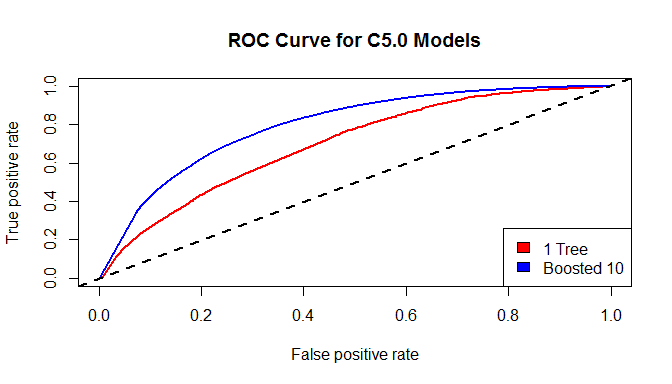
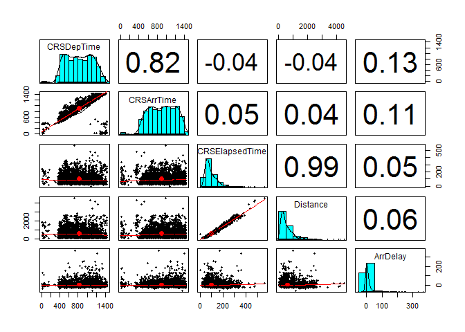
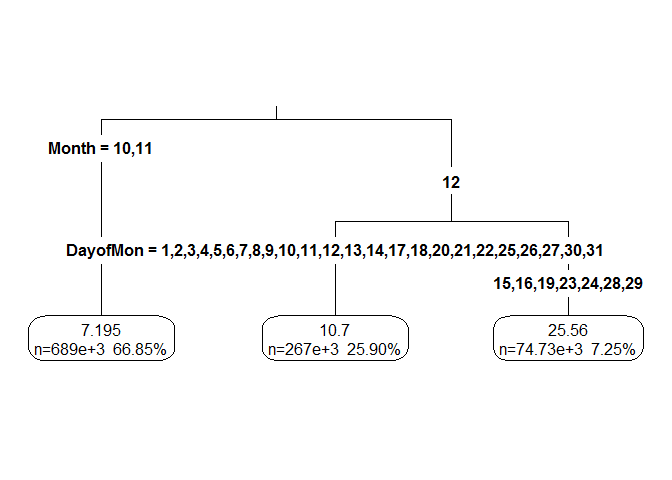

1987 Flight Delay Analysis
================
Stuart Liu-Mayo

The Data
========

We will be using data provided by the Statistical Computing section of the American Statistical Association which includes over 20 years of data on flights in the United States with nearly 120 million observations in total. We will be examining only the data from 1987, which includes over 1.3 million observations.

``` r
df.planes <- read.csv("1987.csv", stringsAsFactors=FALSE)
```

Data Exploration and Preparation
================================

``` r
str(df.planes, list.len=10)
```

    ## 'data.frame':    1311826 obs. of  29 variables:
    ##  $ Year             : int  1987 1987 1987 1987 1987 1987 1987 1987 1987 1987 ...
    ##  $ Month            : int  10 10 10 10 10 10 10 10 10 10 ...
    ##  $ DayofMonth       : int  14 15 17 18 19 21 22 23 24 25 ...
    ##  $ DayOfWeek        : int  3 4 6 7 1 3 4 5 6 7 ...
    ##  $ DepTime          : int  741 729 741 729 749 728 728 731 744 729 ...
    ##  $ CRSDepTime       : int  730 730 730 730 730 730 730 730 730 730 ...
    ##  $ ArrTime          : int  912 903 918 847 922 848 852 902 908 851 ...
    ##  $ CRSArrTime       : int  849 849 849 849 849 849 849 849 849 849 ...
    ##  $ UniqueCarrier    : chr  "PS" "PS" "PS" "PS" ...
    ##  $ FlightNum        : int  1451 1451 1451 1451 1451 1451 1451 1451 1451 1451 ...
    ##   [list output truncated]

There are 1,311,826 observations of 29 variables. However, the variables TailNum, AirTime, TaxiIn, TaxiOut, CancellationCode, CarrierDelay, WeatherDelay, NASDelay, Security Delay, and LateAircraftDelay are 100% `NA` values and thus will not be considered in our analysis. This is because they represent information that was not being collected during the time we are investigating. We can remove them from the data set now.

``` r
to.drop <- c(11, 14, 20, 21, 23, 25:29)
df.planes <- df.planes[-to.drop]
```

The categorical features are Year (which has a value of 1987 for all the observations here and thus will be excluded), Month, DayofMonth, DayofWeek, UniqueCarrier, FlightNum, Origin, Dest, Cancelled, and Diverted.

The numeric features are DepTime, CRSDepTime, ArrTime, CRSArrTime, ActualElapsedTime, CRSElapsedTime, ArrDelay, DepDelay, and Distance.

The Month, DayofMonth, and DayofWeek variables could have also been treated as numerics instead of as factors, however we felt it more appropriate to use them as factors in our models.

A number of variables are clock times coded in 24 hour format. This means that it is inappropriate to simply use them as numeric variables because while they range from 1 to 2400, the tens place can never exceed 5. Therefore we will first convert these clock times to minutes since midnight.

``` r
to.minutes <- 5:8
hr2min <- function(x) {
    return(as.integer(floor(x / 100) * 60 + x %% 100))
}
for (column in to.minutes) {
    df.planes[, column] <- hr2min(df.planes[, column])
}
```

One further data addition must be made before we can examine the other characteristics of the data. The Distance variable is missing information for several flights into and out of Ketchikan International Airport. We can look up the filed distances for these flights on FlightAware and input them into the data set.

``` r
df.planes$Distance[(df.planes$Origin %in% c("SEA", "KTN")
                    & df.planes$Dest %in% c("SEA", "KTN"))] <- 679
df.planes$Distance[(df.planes$Origin %in% c("WRG", "KTN")
                    & df.planes$Dest %in% c("WRG", "KTN"))] <- 570
df.planes$Distance[(df.planes$Origin %in% c("SIT", "KTN")
                    & df.planes$Dest %in% c("SIT", "KTN"))] <- 183
df.planes$Distance[(df.planes$Origin %in% c("JNU", "KTN")
                    & df.planes$Dest %in% c("JNU", "KTN"))] <- 234
```

Now we can examine the variables in more detail. First, we compute the means of the numeric variables, aggregated by month:

``` r
numerics <- c(5:8, 11:14, 17)
aggregate(df.planes[, numerics], by=list(Month=df.planes$Month), mean,
          na.rm=TRUE)
```

    ##   Month  DepTime CRSDepTime  ArrTime CRSArrTime ActualElapsedTime
    ## 1    10 830.4881   826.6255 907.7634   905.9416          100.7109
    ## 2    11 832.8454   827.6539 908.0249   906.7537          102.1647
    ## 3    12 835.2642   827.4810 907.3903   906.3594          103.7221
    ##   CRSElapsedTime  ArrDelay  DepDelay Distance
    ## 1        99.5262  6.004721  5.057520 587.9256
    ## 2       100.6248  8.467165  7.127676 590.7347
    ## 3       101.7269 13.987177 12.098172 594.9067

And the standard deviations for the numeric variables, aggregated by month:

``` r
aggregate(df.planes[, numerics], by=list(Month=df.planes$Month), sd,
          na.rm=TRUE)
```

    ##   Month  DepTime CRSDepTime  ArrTime CRSArrTime ActualElapsedTime
    ## 1    10 285.5451   283.5805 295.2509   291.3430          60.85022
    ## 2    11 286.7009   283.1380 298.4640   291.7285          61.52476
    ## 3    12 290.1128   284.0622 304.1956   293.2794          63.07846
    ##   CRSElapsedTime ArrDelay DepDelay Distance
    ## 1       60.64662 18.55822 19.79134 496.3595
    ## 2       61.21103 24.46441 20.61539 497.5438
    ## 3       61.82347 32.18375 29.85936 499.9877

Similarly, we can tabulate the counts for the categorical features, again aggregated by month.

First we will recode the categoricals as feature variables:

``` r
to.factor <- c(1:4, 9, 10, 15, 16, 18, 19)
for (column in to.factor) {
    df.planes[, column] <- as.factor(df.planes[, column])
}
```

Now we can tabulate the features.

Day of Week:

``` r
aggregate(df.planes$DayOfWeek, by=list(month=df.planes$Month), table)
```

    ##   month   x.1   x.2   x.3   x.4   x.5   x.6   x.7
    ## 1    10 59243 59214 59076 73966 73739 67256 56126
    ## 2    11 73057 58441 58763 55614 54637 52767 69524
    ## 3    12 58411 72583 72396 71331 56537 53347 55798

``` r
aggregate(df.planes$DayOfWeek, by=list(month=df.planes$Month), 
          function(x) round(prop.table(table(x)), digits=4))
```

    ##   month    x.1    x.2    x.3    x.4    x.5    x.6    x.7
    ## 1    10 0.1321 0.1320 0.1317 0.1649 0.1644 0.1499 0.1251
    ## 2    11 0.1728 0.1382 0.1390 0.1315 0.1292 0.1248 0.1644
    ## 3    12 0.1326 0.1648 0.1644 0.1620 0.1284 0.1211 0.1267

Unique Carrier:

``` r
aggregate(df.planes$UniqueCarrier, by=list(month=df.planes$Month), table)
```

    ##   month  x.AA  x.AS  x.CO  x.DL  x.EA  x.HP  x.NW x.PA (1)  x.PI  x.PS
    ## 1    10 56091  7432 42756 63104 37048 15026 37590     5134 39228 14405
    ## 2    11 53200  6967 39408 60150 34865 14939 34342     5615 37707 13540
    ## 3    12 55830  7007 40838 62559 36863 15434 36341     6036 39547 13761
    ##    x.TW  x.UA  x.US  x.WN
    ## 1 23823 52952 32293 21738
    ## 2 22125 48702 31006 20237
    ## 3 23702 50970 31515 20000

``` r
aggregate(df.planes$UniqueCarrier, by=list(month=df.planes$Month), 
          function(x) round(prop.table(table(x)), digits=4))
```

    ##   month   x.AA   x.AS   x.CO   x.DL   x.EA   x.HP   x.NW x.PA (1)   x.PI
    ## 1    10 0.1250 0.0166 0.0953 0.1407 0.0826 0.0335 0.0838   0.0114 0.0874
    ## 2    11 0.1258 0.0165 0.0932 0.1423 0.0825 0.0353 0.0812   0.0133 0.0892
    ## 3    12 0.1268 0.0159 0.0927 0.1420 0.0837 0.0350 0.0825   0.0137 0.0898
    ##     x.PS   x.TW   x.UA   x.US   x.WN
    ## 1 0.0321 0.0531 0.1180 0.0720 0.0485
    ## 2 0.0320 0.0523 0.1152 0.0733 0.0479
    ## 3 0.0312 0.0538 0.1157 0.0716 0.0454

Cancelled:

``` r
aggregate(df.planes$Cancelled, by=list(month=df.planes$Month), table)
```

    ##   month    x.0    x.1
    ## 1    10 445619   3001
    ## 2    11 417612   5191
    ## 3    12 428910  11493

``` r
aggregate(df.planes$Cancelled, by=list(month=df.planes$Month), 
          function(x) round(prop.table(table(x)), digits=4))
```

    ##   month    x.0    x.1
    ## 1    10 0.9933 0.0067
    ## 2    11 0.9877 0.0123
    ## 3    12 0.9739 0.0261

Diverted:

``` r
aggregate(df.planes$Diverted, by=list(month=df.planes$Month), table)
```

    ##   month    x.0    x.1
    ## 1    10 447781    839
    ## 2    11 421708   1095
    ## 3    12 438522   1881

``` r
aggregate(df.planes$Diverted, by=list(month=df.planes$Month), 
          function(x) round(prop.table(table(x)), digits=4))
```

    ##   month    x.0    x.1
    ## 1    10 0.9981 0.0019
    ## 2    11 0.9974 0.0026
    ## 3    12 0.9957 0.0043

Note that tables of certain categorical variables have not been reproduced here due to the very large number of levels they contain. There are 237 unique airports in the data set and 2161 unique flight numbers so reproducing the tables of counts for these variables would take several pages.

Lastly, we can drop the Year column since all our data is from 1987 and so will not be useful for prediction.

``` r
df.planes <- df.planes[-1]
```

Encoding `ArrivedLate` Logical
==============================

We wish to create a logical variable indicating whether or not the flights arrived late, which we will call `ArrivedLate`. We could simply check the `ArrDelay` variable and call a flight late if the arrival delay is greater than zero (or some acceptable threshold, like the 15 minutes used by the FAA).

However, we have some doubts about the accuracy of the arrival delay calculation used. Its range is suspiciously large, extending to -1302 minutes (arriving over 21 hours early!) and 1033 minutes (17 hours late). While 17 hours late sounds plausible for some really terrible weather delays, 21 hours early sounds like it should be a mistake.

We would like to verify the `ArrDelay` numbers before continuing. To this end, we will write a function `IsCorrectDelay` that given a row of our data set will verify that the entered arrival delay is at least plausible. Since some corner cases involve flights arriving on different dates from their departure date, we cannot expect to compute an expected delay from the scheduled arrival time and actual arrival time in all cases. Instead, our function will use the scheduled arrival time and entered arrival delay to compute the actual arrival time and return `TRUE` if it matches the entered arrival time and `FALSE` otherwise.

``` r
IsCorrectDelay <- function(a.row) {
    # return NA if any of the scheduled arrival, arrival, or arrival delay are
    # NA
    if (is.na(a.row[6]) | is.na(a.row[7]) | is.na(a.row[12])) {return(NA)}
    
    # add arrival delay and scheduled arrival to compute actual arrival
    computed.arrival <- as.integer(a.row[7]) + as.integer(a.row[12])
    
    # if the flight is scheduled to arrive after midnight but arrives early,
    # before midnight, computed.arrival will be negative and we must add 1440
    # to get a meaningful time
    computed.arrival <- ifelse(computed.arrival <= 0, computed.arrival + 1440,
                               computed.arrival)
    
    # similarly subtract 1440 if the flight is expected before midnight but
    # arrives after
    computed.arrival <- ifelse(computed.arrival > 1440,
                               computed.arrival - 1440, computed.arrival)
    # return TRUE if computed matches actual, FALSE otherwise
    is.correct <- computed.arrival == as.integer(a.row[6])
    return(is.correct)
}
```

We can now apply this to the data frame to check each row's arrival delay arithmetic.

``` r
is.correct <- apply(df.planes, 1, IsCorrectDelay)
summary(is.correct)
```

    ##    Mode    TRUE    NA's 
    ## logical 1288326   23500

We have the 23,500 NA flights that were either diverted or cancelled, and the rest have arithmetic that agrees. Evidently the flights with outlier arrival delays have some more complicated explanation for their value. We will leave all flights in the data set since although we are surprised by the outlier arrival delays we don't have an articulable reason to exclude them. They also represent only .05% of the data so shouldn't have a strong effect on our ability to predict the other, more normal flights.

Now we can create a new variable, `ArrivedLate`, that we will build a model to predict. It will be `TRUE` when the flight has an arrival delay greater than or equal to 15 minutes, is diverted, or is cancelled, and `FALSE` otherwise.

``` r
df.planes$ArrivedLate <- ifelse((df.planes$ArrDelay >= 15
                                 | is.na(df.planes$ArrDelay)), "late",
                                "on time")
df.planes$ArrivedLate <- as.factor(df.planes$ArrivedLate)
summary(df.planes$ArrivedLate)
```

    ##    late on time 
    ##  336270  975556

``` r
round(prop.table(table(df.planes$ArrivedLate)), 4)
```

    ## 
    ##    late on time 
    ##  0.2563  0.7437

Classifying Late Flights
========================

We intend to train a C5.0 decision tree to predict whether or not a flight will be late. The C5.0 algorithm does not require any further preparation of the data, such as normalization, however we do need to further select the data. We have a number of variables that we must set aside because when performing prediction on new observations we would not have them available.

These variables include DepTime, ArrTime, ActualElapsedTime, ArrDelay, DepDelay, Cancelled, and Diverted. We may want to use them later, however, so instead of dropping them entirely we will set them aside in another data frame.

``` r
unused <- c(4, 6, 10, 12, 13, 17, 18)
unused.planes <- df.planes[unused]
df.planes <-df.planes[-unused]
```

Next we must divide up our data set into testing and training sets. We will train on 80% of the data and hold out 20% for cross-validation.

``` r
set.seed(6620)
n <- nrow(df.planes)
n.test <- floor(.2 * n)
idx.test <- sample(1:n, n.test)
train.planes <- df.planes[-idx.test, ]
test.planes <- df.planes[idx.test, ]
```

We must verify that the proportions of late and on time flights are roughly equal between the training and testing sets:

``` r
round(prop.table(table(train.planes$ArrivedLate)), 4)
```

    ## 
    ##    late on time 
    ##  0.2564  0.7436

``` r
round(prop.table(table(test.planes$ArrivedLate)), 4)
```

    ## 
    ##    late on time 
    ##   0.256   0.744

With good agreement, we are now prepared to train a C5.0 decision tree. This algorithm is implemented in `R` by the `C5.0` function in the `C50` package.

``` r
library(C50)
modelC50 <- C5.0(ArrivedLate ~ ., data=train.planes)
```

To evaluate the decision tree's performance, we compute the in-sample error (error on training set) and out-of-sample error (error on testing set).

``` r
in.modelC50.pred <- predict(modelC50, train.planes)
mean(in.modelC50.pred == train.planes$ArrivedLate)
```

    ## [1] 0.784982

``` r
out.modelC50.pred <- predict(modelC50, test.planes)
mean(out.modelC50.pred == test.planes$ArrivedLate)
```

    ## [1] 0.7721571

``` r
library(gmodels)
CrossTable(test.planes$ArrivedLate, out.modelC50.pred, prop.chisq=FALSE,
           prop.c=FALSE, prop.r=FALSE, dnn=c("actual", "predicted"))
```

    ## 
    ##  
    ##    Cell Contents
    ## |-------------------------|
    ## |                       N |
    ## |         N / Table Total |
    ## |-------------------------|
    ## 
    ##  
    ## Total Observations in Table:  262365 
    ## 
    ##  
    ##              | predicted 
    ##       actual |      late |   on time | Row Total | 
    ## -------------|-----------|-----------|-----------|
    ##         late |     17571 |     49606 |     67177 | 
    ##              |     0.067 |     0.189 |           | 
    ## -------------|-----------|-----------|-----------|
    ##      on time |     10172 |    185016 |    195188 | 
    ##              |     0.039 |     0.705 |           | 
    ## -------------|-----------|-----------|-----------|
    ## Column Total |     27743 |    234622 |    262365 | 
    ## -------------|-----------|-----------|-----------|
    ## 
    ## 

Our basic decision tree has achieved 77% accuracy, 26% sensitivity, and 95% specificity on the test set.

We may be able to improve the model through boosting. We will allow the C5.0 algorithm to use up to 10 separate decision trees in a boosted team.

``` r
start <- Sys.time()
boost10 <- C5.0(ArrivedLate ~ ., data=train.planes, trials=10)
Sys.time() - start
```

    ## Time difference of 8.349561 mins

``` r
in.boost10.pred <- predict(boost10, train.planes)
mean(in.boost10.pred == train.planes$ArrivedLate)
```

    ## [1] 0.8463668

``` r
out.boost10.pred <- predict(boost10, test.planes)
mean(out.boost10.pred == test.planes$ArrivedLate)
```

    ## [1] 0.8007204

``` r
CrossTable(test.planes$ArrivedLate, out.boost10.pred, prop.chisq=FALSE,
           prop.c=FALSE, prop.r=FALSE, dnn=c("actual", "predicted"))
```

    ## 
    ##  
    ##    Cell Contents
    ## |-------------------------|
    ## |                       N |
    ## |         N / Table Total |
    ## |-------------------------|
    ## 
    ##  
    ## Total Observations in Table:  262365 
    ## 
    ##  
    ##              | predicted 
    ##       actual |      late |   on time | Row Total | 
    ## -------------|-----------|-----------|-----------|
    ##         late |     25053 |     42124 |     67177 | 
    ##              |     0.095 |     0.161 |           | 
    ## -------------|-----------|-----------|-----------|
    ##      on time |     10160 |    185028 |    195188 | 
    ##              |     0.039 |     0.705 |           | 
    ## -------------|-----------|-----------|-----------|
    ## Column Total |     35213 |    227152 |    262365 | 
    ## -------------|-----------|-----------|-----------|
    ## 
    ## 

Our boosted decision tree has achieved 80% accuracy, 37% sensitivity, and 95% specificity on the test set. All the accuracy gains have been achieved by more accurately recognizing late flights.

We can further examine the effectiveness of the model by constructing the Receiver Operating Characteristic (ROC) Curve.

``` r
library(ROCR)
probs.mc50 <- predict(modelC50, test.planes, type="prob")
pred.mc50 <- prediction(predictions=probs.mc50[, 2],
                        labels=test.planes$ArrivedLate)
perf.mc50 <- performance(pred.mc50, measure="tpr", x.measure="fpr")
probs.b10 <- predict(boost10, test.planes, type="prob")
pred.b10 <- prediction(predictions=probs.b10[, 2],
                        labels=test.planes$ArrivedLate)
perf.b10 <- performance(pred.b10, measure="tpr", x.measure="fpr")
plot(perf.mc50, main="ROC Curve for C5.0 Models", col="red", lwd=2)
plot(perf.b10, col="blue", lwd=2, add=TRUE)
abline(a=0, b=1, lwd=2, lty="dashed")
legend("bottomright", legend=c("1 Tree", "Boosted 10"), fill=c("red", "blue"))
```



Somewhat unsurprisingly, the boosted model outperforms the unboosted model at all decision thresholds.

Predicting Arrival Delay
========================

Next we would like to attempt to predict the numeric arrival delay, instead of simply classifying flights as late or on time. To do so, we must first add the `ArrDelay` vector back in to our data set and relegate the `ArrivedLate` variable.

``` r
df.planes <- cbind(df.planes, ArrDelay=unused.planes$ArrDelay)
unused.planes <- cbind(unused.planes[-4], ArrivedLate=df.planes$ArrivedLate)
df.planes <- df.planes[-12]
```

Before training a prediction algorithm, we would like to examine the correlations amongst the numeric predictors we are using.

``` r
library(psych)
```

    ## Warning: package 'psych' was built under R version 3.2.5

``` r
pairs.panels(df.planes[sample(1:nrow(df.planes), 5000), c(4, 5, 8, 11, 12)])
```



Immediately apparent is the very high correlation between scheduled departure time and scheduled arrival time, and between scheduled elapsed time and distance. The reasons behind these correlations should be fairly clear.

However, also apparent is that no numeric variable has a strong linear relationship with arrival delay. Therefore we will have to rely on interactions and the contribution of the categorical variables to help predict delays.

To this end we will use a regression tree, computed via the CART algorithm. This is implemented in `R` by the `rpart` function from the `rpart` package.

First, however, we must again divide our data into training and testing sets.

``` r
set.seed(6620)
n <- nrow(df.planes)
n.test <- floor(.2 * n)
idx.test <- sample(1:n, n.test)
train.planes <- df.planes[-idx.test, ]
test.planes <- df.planes[idx.test, ]
```

Now we are ready to fit a CART model to the data.

``` r
library(rpart)
m.rpart <- rpart(ArrDelay ~ ., data=train.planes)
library(rpart.plot)
```

    ## Warning: package 'rpart.plot' was built under R version 3.2.5

``` r
rpart.plot(m.rpart, digits=4, fallen.leaves=TRUE, type=3, extra=101)
```



The visualization reveals that we are merely predicting which days of the month generally experience the most unusual delays. It seems likely that we are overfitting the data with this model.

We can verify by examining the test data set:

``` r
pred.rpart <- predict(m.rpart, test.planes)
summary(pred.rpart)
```

    ##    Min. 1st Qu.  Median    Mean 3rd Qu.    Max. 
    ##   7.195   7.195   7.195   9.515  10.700  25.560

``` r
summary(test.planes$ArrDelay)
```

    ##      Min.   1st Qu.    Median      Mean   3rd Qu.      Max.      NA's 
    ## -1283.000    -3.000     4.000     9.494    14.000   869.000      4688

``` r
cor(pred.rpart[!is.na(test.planes$ArrDelay)],
    test.planes$ArrDelay[!is.na(test.planes$ArrDelay)])
```

    ## [1] 0.1864843

As feared, the distribution of predicted delays seems to have little in common with the distribution of actual delays. With a correlation of only .19, it seems that this model is doing a very poor job of predicting the arrival delay.

One last performance metric that should be considered here is the mean absolute error (MAE).

``` r
MAE <- function(actual, predicted) {
    return(mean(abs(actual - predicted), na.rm=TRUE))
}
MAE(test.planes$ArrDelay, pred.rpart)
```

    ## [1] 14.13061

On average, our predicted values are only off by 14 minutes. Of course, this is because our algorithm is simply predicting values very close to the overall mean!

``` r
MAE(test.planes$ArrDelay, mean(test.planes$ArrDelay, na.rm=TRUE))
```

    ## [1] 14.37481

In fact, the "stupid" model that simply predicts the overall mean in all cases has MAE slightly larger than our model, implying that our model is actually providing some predictive value.

Final Notes
===========

The major challenge in performing classification and prediction with this data set is its sheer size. With over 1.3 million rows and several factors with very large numbers of unique levels it is very difficult to apply any statistical learning algorithms simply from a data management and computational perspective. It is particularly difficult to apply any of the more exotic algorithms such as Artificial Neural Networks or Random Forests that are more computationally intensive and require carefully curated inputs.

We found the greatest success by applying decision trees and regression trees, which are fundamentally some of the most simple algorithms that see common usage. Particularly when boosted through bagging of multiple models, trees offer impressive predictive accuracy with comparatively low computational requirements. It is no wonder that trees remain a popular algorithm for a wide variety of classification and prediction tasks.
