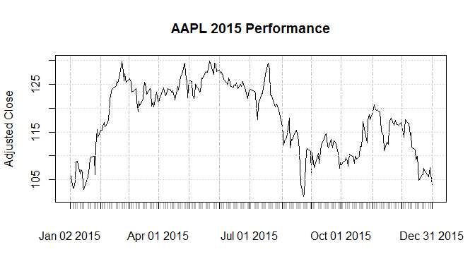
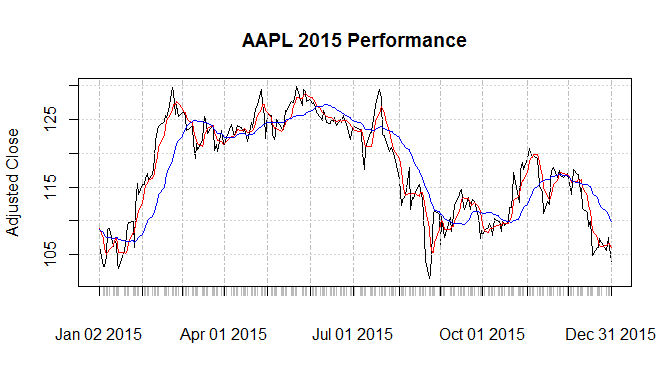
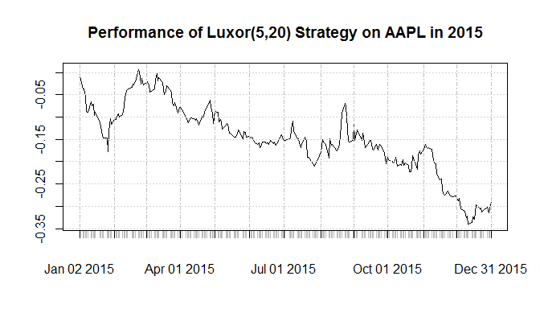
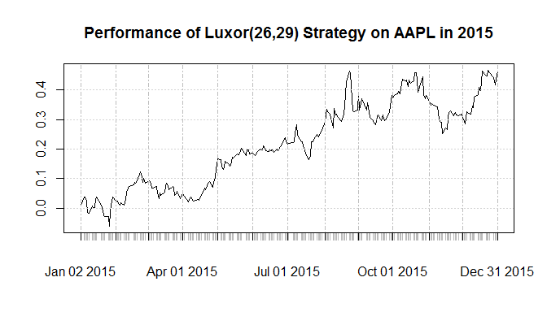
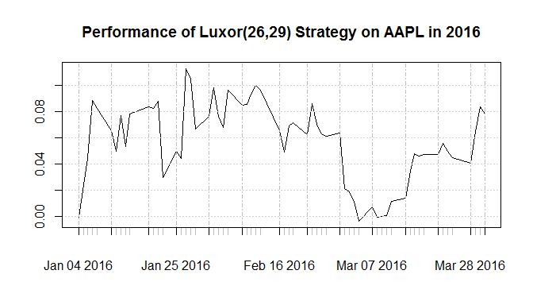

Testing Luxor Strategies
================
Stuart Liu-Mayo
June 2016

The Luxor Strategy
==================

The Luxor strategy is a very simple two moving average trading strategy. The objective is to identify and trade on upwards and downwards trends in equity prices. Originally formulated as a strategy for trading in foreign exchange markets, the strategy is nevertheless general enough to be applied to any traded equity.

The idea is to compute two simple moving averages with different periods and take a long position when the fast moving average is greater than the slow moving average and a short position otherwise. The hope is that this identifies longer-term trends that we are able to ride and furthermore that this outperforms a simple buy-and-hold plan.

The crux of the issue then is to identify which moving averages successfully produce winning Luxor strategies and to test them to demonstrate the hoped-for performance.

Visualizing the Luxor Strategy
==============================

To further understand the decision process, we will first visualize the behavior of the strategy. Suppose we choose to trade Apple (AAPL) stock daily using a 5-period fast moving average and a 20 period slow moving average. We can write this strategy as a Luxor(5,20) strategy. We choose to test the performance of the strategy during the calendar year 2015.

``` r
library(quantmod)   # use the quantmod library's historical price tools
getSymbols("AAPL")  # get historical prices for AAPL from Yahoo! finance
```

    ## [1] "AAPL"

``` r
# plot AAPL's price during 2015
plot(AAPL["2015", 6], main="AAPL 2015 Performance", ylab="Adjusted Close")
```



The buy-and-hold performance of AAPL during 2015 was quite poor. Although up nearly 30% during the first half of the year, it ended up a mere 2% at the end of December. Since there are clear periods during which the price trended up or down, however, we may hold out some hope that a Luxor strategy could help us identify and trade upon these trends.

``` r
MA.fast <- SMA(AAPL[, 6], 5)   # 5-period fast SMA
MA.slow <- SMA(AAPL[, 6], 20)  # 20-period slow SMA

# plot AAPL's price during 2015 with overlaid moving averages
plot(AAPL["2015", 6], main="AAPL 2015 Performance", ylab="Adjusted Close")
lines(MA.fast["2015"], col="red")
lines(MA.slow["2015"], col="blue")
```



As expected, the fast moving average (plotted in red) leads the slow moving average (plotted in blue) in the longer-term trends of the stock movement and the crossover points of the two moving averages occur where these trends begin and end. This will not be surprising to anyone who has read investment literature; when the 50-period and 200-period moving averages are used to generate this plot the crossovers are often called the "Golden Cross" and "Death Cross" when the long-term trends are shifting up and down respectively.

In the Luxor trading strategy, our position will be determined by the sign of the difference between the fast and slow moving averages. When the fast SMA is greater than the slow SMA the sign of the difference will be 1 and we will take a long position. When the fast SMA is lesser than the slow SMA the sign of the difference will be -1 and we will take a short position.

``` r
# compute and plot position of Luxor(5,20) strategy during 2015
position <- sign(MA.fast - MA.slow)
plot(position["2015"], main="Position of Luxor(5,20) Strategy in 2015")
```


``` r
# compute and plot trades made during 2015 in executing the Luxor(5,20)
trades <- sign(diff(position))
plot(trades["2015"], main="Trades made by Luxor(5,20) Strategy in 2015")
```


As we can see, our position is a 1 or -1 that tracks the trends identified by the crossing moving averages, and we trade every time such a crossover occurs.

We also recognize that the daily return of our strategy is simply the daily return of the equity multiplied by the position computed for the prior day. Armed with this realization and the understanding that our present performance is the cumulative product of previous returns, we are now prepared to compute the performance of our strategy.

``` r
# compute AAPL's daily returns
AAPL.dailies <- dailyReturn(AAPL[, 6])
# compute and plot strategy performance
perf.5.20 <- (cumprod((AAPL.dailies["2015"]) * (lag(position, 1)["2015"]) + 1)
              - 1)
plot(perf.5.20, main="Performance of Luxor(5,20) Strategy on AAPL in 2015")
```



Unfortunately for us, our strategy has performed terribly. Had we actually implemented this strategy, by the end of the year we would be down almost 30%!

Finding the Best Luxor Strategy
===============================

These disappointing results do not necessarily imply that all Luxor strategies perform terribly. We can use a grid search to find strategies that perform better. To do so, we will compute the performance of each strategy with fast moving averages between 2 and 50 periods and slow moving averages up to 200 periods.

``` r
returns <- matrix(rep(NA, 10000), nrow=50) # create grid of returns 
# compute returns for the [fast, slow] indicator pairs
for (fast in 2:50) {
    for (slow in (fast + 1):200) {
        MA.fast <- SMA(AAPL[, 6], fast) # compute fast MA
        MA.slow <- SMA(AAPL[, 6], slow) # compute slow MA
        position <- sign(MA.fast - MA.slow) # compute position
        perf <- cumprod(AAPL.dailies["2015"]
                        * (lag(position, 1)["2015"]) + 1) - 1
        returns[fast, slow] <- as.numeric(last(perf))
    }
}

# report the pair(s) with the best performance
best <- which(returns == max(returns, na.rm=TRUE), arr.ind=TRUE)
best.fast <- best[1]
best.slow <- best[2]
print(c(best.fast, best.slow))
```

    ## [1] 26 29

``` r
# plot the performance of the best luxor strategy
position <- sign(SMA(AAPL[, 6], 26) - SMA(AAPL[, 6], 29))
perf.26.29 <- cumprod(AAPL.dailies["2015"]
                      * (lag(position, 1)["2015"]) + 1) - 1
plot(perf.26.29, main="Performance of Luxor(26,29) Strategy on AAPL in 2015")
```



The best possible Luxor trading strategy uses a 26-period fast moving average and a 29-period moving average and shows over 40% growth during the period.

Testing the Luxor Strategy
==========================

Of course, we cannot possibly know in advance which trading strategy will produce the best returns, so our hope must be that our chosen strategy maintains its performance into the future. To test this we can apply the Luxor(26,29) to some new data and see how it performs. We will test it on the first 3 months of 2016, January-March.

``` r
perf.26.29 <- cumprod(AAPL.dailies["2016-01-01/2016-05-31"]
                      * (lag(position, 1)["2016-01-01/2016-03-31"]) + 1) - 1
plot(perf.26.29, main="Performance of Luxor(26,29) Strategy on AAPL in 2016")
```



While still showing positive returns during the test period, gone are the amazing returns we found during 2015. Clearly we are either overfitting the model, the performance is degrading over time, or both.

If one wished to build a successful algorithmic trading system using a Luxor strategy, obviously it would be insufficient to simply identify a successful past strategy and implement it. Much effort would have to go into tuning the system using ensemble indicators, recomputing optimal strategies, weighting past data, and the like. While such methods are beyond the scope of this introductory document, hopefully you are now equipped to at minimum understand this trading strategy and test it yourself.
